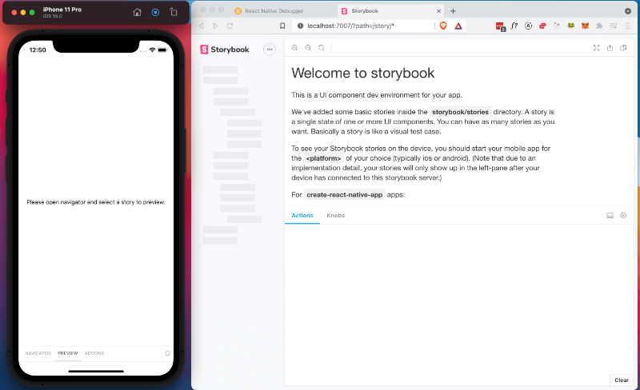
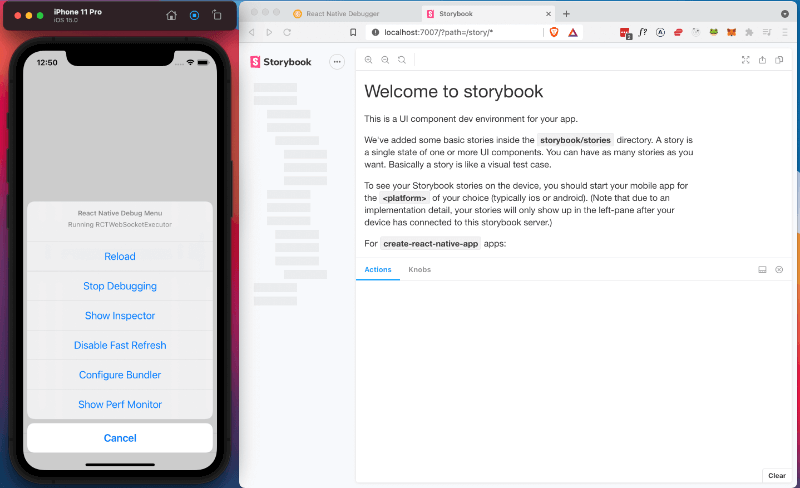
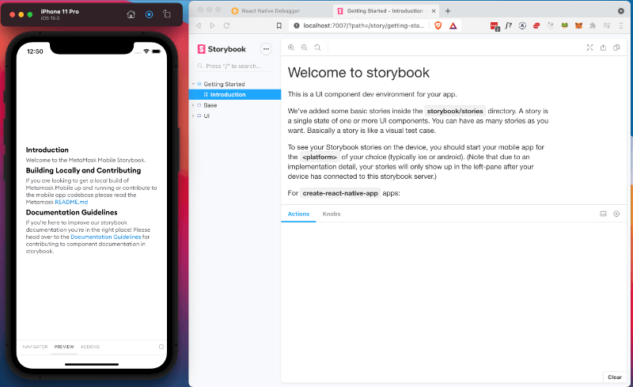
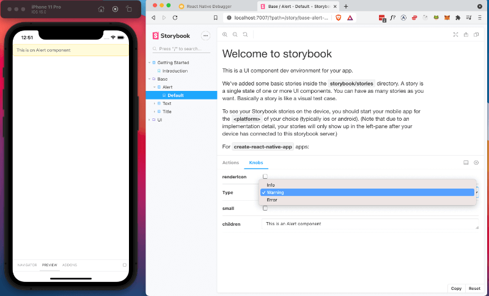

# Documentation Guidelines

## General Guidelines

Thorough documentation makes it much easier for a component to be found, adapted and reused. It also provides space for explanation and reasoning for a component. This is useful as components become more complex.

## Using React Native Storybook

The below steps will try to explain how best to use Storybook for React Native.

In the React Native Storybook [Getting Started](https://github.com/storybookjs/react-native/tree/v5.3.25#getting-started) guide they suggest you change the default export to be the storybook UI. We should come up with a better method than this. See [other ways to render storybook](https://github.com/storybookjs/react-native/tree/v5.3.25#other-ways-to-render-storybook)) but for now:

Comment out everything in the root `./index.js` and add `export { default } from "./storybook";` this will replace the app with storybook.

Once you have added `export { default } from "./storybook";` to the root `./index.js` run:

```
yarn watch
```

open a new terminal window and run

```
yarn start:ios
```

then

```
yarn storybook
```

you should be greeted with this screen.



If the storybook menu is stuck in "loading". You should be able to resolve this by reloading the app in the simulator



Once the app has been reloaded you should be able to see the components in the storybook side menu in the web browser



You can use the storybook web browser to navigate through stories. You should also be able to use storybook plugins including actions and knobs.



**Please note you will not be able to view the components in the storybook web browser. The web browser is best used for navigation and use of plugins**

## Creating a Story

1. Create a `ComponentName.stories.js` file (example `Alert` story below)
2. Run `yarn storybook` (Uses [storybook loader](https://github.com/elderfo/react-native-storybook-loader) to automatically find `*.stories.js` files **required step after every new story file is created**)
3. Run `yarn ios`

Example `Alert` story

```tsx
// app/components/Base/Alert.stories.js

// Import react
import React from 'react';

// Import storybook functions and plugins
import { storiesOf } from '@storybook/react-native';
import { action } from '@storybook/addon-actions';
import { text, boolean, select } from '@storybook/addon-knobs';

// Import the component and any supplementary components / styles that will help with documentation / interactivity
import Alert, { AlertType } from './Alert';
import Text from './Text';
import { colors, fontStyles } from ' ../../../styles/common';
import EvilIcons from 'react-native-vector-icons/EvilIcons';

// Add any styles that are needed
const styles = {
	alertIcon: {
		fontSize: 20,
		...fontStyles.bold,
		color: colors.yellow,
		marginRight: 6,
	},
};

// Create story using the component directory and name for the title
storiesOf('Base / Alert', module)
	.addDecorator((getStory) => getStory())
	// The naming convention for a component's the first story should be "Default"
	.add('Default', () => {
		const renderIconKnob = boolean('renderIcon', false);
		return (
			<Alert
				// All appropriate props should include an action or knob to show component api options
				type={select('Type', [AlertType.Info, AlertType.Warning, AlertType.Error], AlertType.Warning)}
				small={boolean('small', false)}
				renderIcon={renderIconKnob ? () => <EvilIcons name="bell" style={styles.alertIcon} /> : () => null}
				onPress={action('onPress')}
			>
				<Text>{text('children', 'This is an Alert component')}</Text>
			</Alert>
		);
	});
```

Nice work! You're now ready to start creating component documentation using storybook 🎉 👍

> Note: Currently React Native Storybook is at v5.3 hoping to upgrade to [v6](https://github.com/storybookjs/react-native/blob/next-6.0/v6README.md) soon..
